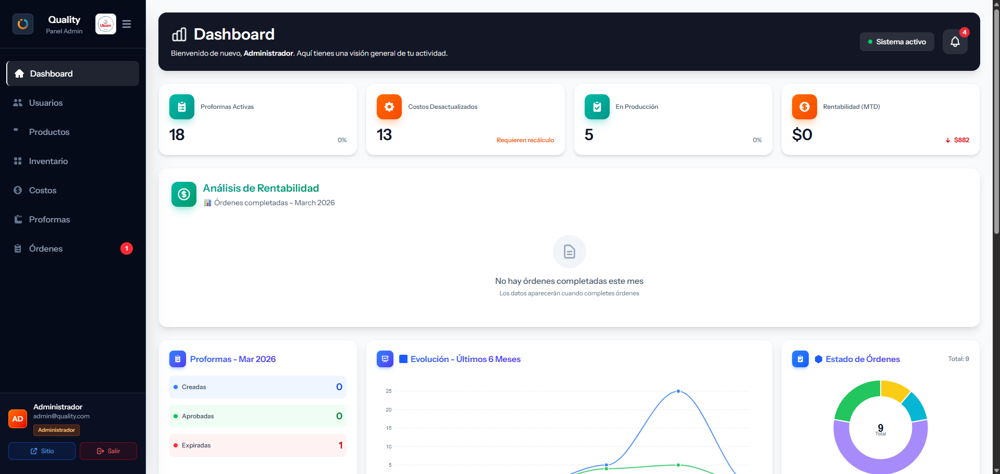
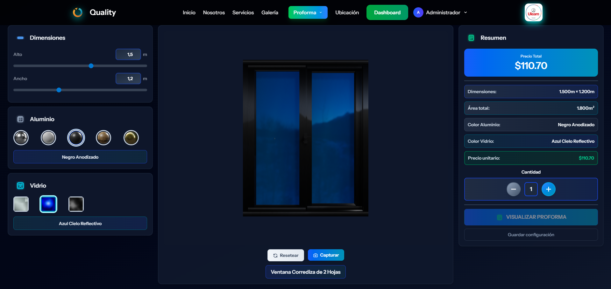

# Quality

Plataforma web para la gestión de proformas y ordenes mediante la configuracion de materiales, productos y  costos asociados.

## Descripción

Este sistema centraliza el control de insumos y costos para optimizar el proceso de cotización, permitiendo trabajar con distintas unidades de cálculo y generar proformas de forma rápida y consistente.

## Funcionalidades principales

- Gestiona materiales con diferentes tipos de cálculo (unidad, pieza y dimensiones).
- Administra productos y reglas de configuración para escenarios de cotización.
- Genera proformas con estimaciones de costos según parámetros definidos.
- Facilita el trabajo administrativo con una interfaz enfocada en operación diaria.

### Panel principal

### Configurador

